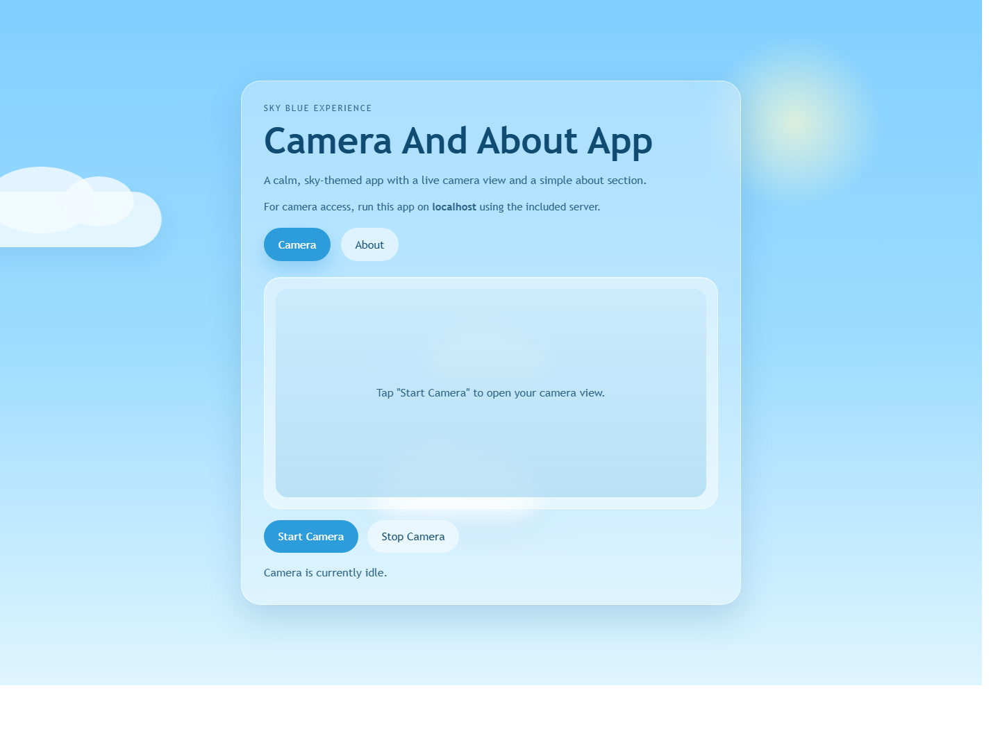

# AirTouch Controller

A camera-and-gesture project with two parts:

- A sky-themed browser demo with camera, hand landmarks, and an on-screen finger mouse
- A Windows Python prototype for system-wide air-mouse control using hand tracking

## Preview



## Project Direction

Core flow:

`Camera -> Hand Detection -> Finger Tracking -> Gesture Detection -> Action`

Current stack:

- `OpenCV` for camera capture in the native Windows helper
- `MediaPipe` for 21 hand landmarks including the index fingertip
- Browser HTML/CSS/JavaScript for the visual demo app

Platform focus:

- `PC / Windows` is the easiest prototype path and is already implemented in Python
- `Android` is possible later, but controlling other apps would need Accessibility Services and more permissions

## Features

- Sky blue interface with a soft glass-style card
- Light animated clouds moving across the background
- Camera start and stop controls
- Friendly status messages for camera access
- Responsive layout for desktop and mobile
- Native Windows gesture mouse prototype

## Run Locally

1. Make sure you have Node.js installed.
2. Start the local server:

```bash
npm start
```

3. Open this URL in your browser:

```text
http://127.0.0.1:3000
```

## Windows Support

This app works on Windows 10 and Windows 11.

- Run `npm start` in Command Prompt or PowerShell
- Or double-click `start-windows.bat` to start the server and open the app in your browser
- Use Microsoft Edge or Google Chrome and allow camera permission when prompted

## Notes

- Camera access works best on `localhost` or `https`
- Allow browser camera permission when prompted
- Lighting and background clutter can reduce hand-detection quality
- Smooth control depends on filtering and camera latency

## System-Wide Windows Gesture Mouse

The browser app can move an on-screen pointer inside the page, but Windows-wide mouse control needs a native helper.

- Run `start-system-mouse.bat` to start the Windows gesture mouse with a preview window
- Run `start-system-mouse-background.bat` to keep it running in the background for other apps
- Raise the index finger to enter active mode
- Move the index finger up or down to scroll, with faster movement producing faster scrolling
- Move the index finger left or right to trigger horizontal swipe-style actions
- Bring the thumb and index finger close together to click
- Press `Ctrl + Alt + Q` to stop the gesture mouse
- The launcher stores Python packages inside the project folder at `.python-packages`
- The first run downloads the hand-landmarker model into `assets/models`
- If you have multiple cameras, edit `windows_system_mouse.py` or pass another `--camera-index`

## Challenges

- Hand tracking can be less stable in low light
- Background control is restricted on mobile platforms
- Scroll and cursor motion need filtering to avoid jitter
- Lower latency makes the experience feel much better

### Files for Windows Gesture Mouse

- `windows_system_mouse.py` - native Windows cursor controller using your index fingertip
- `requirements-system-mouse.txt` - Python dependencies for the system-wide mouse
- `start-system-mouse.bat` - launch with preview
- `start-system-mouse-background.bat` - launch in background mode

## Project Files

- `index.html` - app structure
- `styles.css` - sky blue theme and cloud animation
- `script.js` - tab switching and camera controls
- `server.js` - lightweight local server
- `start-windows.bat` - Windows launcher
